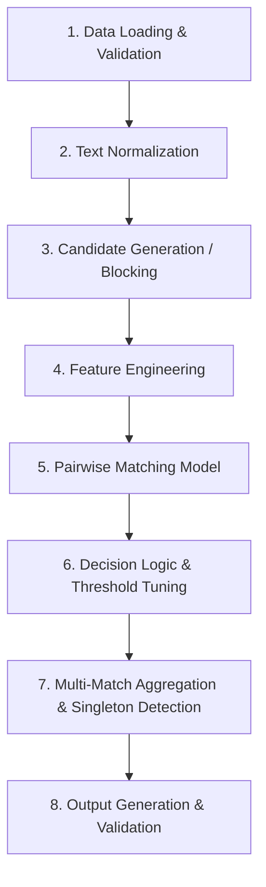

# AWS ML Challenge 2026: Business Entity Resolution Challenge
## Master Development Instructions & Technical Reference

---

## 1. Project Objective

This project provides an end-to-end Machine Learning solution for the **AWS ML Challenge 2026: Business Entity Resolution Challenge**.

### Core Problem
In large-scale commercial platforms, business identity data originates from multiple independent data sources. Each source contributes partial, noisy fragments of information without shared universal identifiers. The objective of Entity Resolution (ER) is to determine which records across these sources refer to the exact same real-world business entity.

### Specific Task
- **Source 1 (`S1-`):** Serves as the deduplicated reference source.
- **Source 2 (`S2-`) & Source 3 (`S3-`):** Secondary data sources containing noisy candidate business records.
- **Goal:** For each Source 1 business entity, identify and link all matching records from Source 2 and Source 3.

### Key Match Dynamics
- A Source 1 entity may match:
  - **Zero records** (Singletons / isolated entities).
  - **One record** (1-to-1 match).
  - **Multiple records** (1-to-many matches across Source 2 and/or Source 3).
- Real-world noise to handle:
  - Inconsistent business names, abbreviations (Corp vs. Corporation, Pvt vs. Private, Ltd vs. Limited), legal suffixes, DBAs/trade names.
  - Punctuation differences ("&" vs. "and"), word-order transpositions, typos, and phonetic variations.
  - Address variations: abbreviations (Rd vs. Road, St vs. Street), missing components (no postal PIN code, no state), landmark-based references (e.g., "Near SBI ATM"), municipal numbering variations, component reordering, and transliterations.
  - Open-set country variations.

---

## 2. Dataset Format & Specifications

### Expected Directory Layout
The dataset consists of tab-separated values (`.tsv`) partitioned into training and testing sets:

```text
dataset/
├── train/
│   ├── train_source1.tsv           # Deduplicated reference records (S1)
│   ├── train_source2.tsv           # Source 2 records (S2)
│   ├── train_source3.tsv           # Source 3 records (S3)
│   └── train_ground_truth.tsv      # Ground truth match pairs for training
└── test/
    ├── test_source1.tsv            # Source 1 query entities (generate matches for ALL)
    ├── test_source2.tsv            # Source 2 candidate records
    └── test_source3.tsv            # Source 3 candidate records
```

*(Note: In the competition repository environment, the original raw files may also reside under `dataset/student_resource/dataset/train` and `dataset/student_resource/dataset/test`.)*

### TSV Parsing Strict Requirement
**All files are strictly tab-separated (`\t`).** Addresses and match lists contain commas. Reading files as comma-separated values will corrupt columns.

```python
import pandas as pd

# ALWAYS specify sep="\t"
df_source1 = pd.read_csv("dataset/train/train_source1.tsv", sep="\t")
```

### Business Record Schema
Each source file (`*_source1.tsv`, `*_source2.tsv`, `*_source3.tsv`) strictly contains four columns:

| Column Name | Type | Description |
| :--- | :--- | :--- |
| `entity_id` | String | Unique record identifier with prefix (`S1-`, `S2-`, or `S3-`) |
| `business_name` | String | Name of the business entity (noisy, abbreviations, typos) |
| `business_address` | String | Postal/geographic address or landmark reference |
| `country` | String | Country string label (e.g., `US`, `India`, `France`) |

*Note: There is no separate `source` column. The source origin is derived directly from the entity ID prefix (`S1-`, `S2-`, `S3-`). Do not create or expect an external source column.*

---

## 3. Country Handling (Open-Set Feature)

`country` is an **open-set string feature**:
- **Training Set:** Contains records from `US` and `India`.
- **Test Set:** Contains records from `US`, `India`, and an unseen country: **`France`**.

### Strict Country Rules
1. **Never hard-code** the pipeline or filters to only `{US, India}`.
2. **Never filter out France** or any unseen country during inference.
3. Treat `country` as a generic, open-set string feature (e.g., equality check, string compatibility, or language/character domain adaptation).
4. Every Source 1 test entity—regardless of whether its country is US, India, or France—**must appear** in the final output.

---

## 4. Ground Truth Specifications

Training ground truth is located at `dataset/train/train_ground_truth.tsv` with two columns:

| Column Name | Type | Description |
| :--- | :--- | :--- |
| `source1_entity_id` | String | The reference entity ID (e.g., `S1-00001`) |
| `matched_entity_ids` | String | Comma-separated list of matching S2/S3 entity IDs (e.g., `S2-00047,S3-00812`) |

- **Singletons:** An empty or blank `matched_entity_ids` field signifies that the Source 1 entity has **zero matches**.
- **Usage:** Ground truth is strictly for model training, feature selection, threshold tuning, and local cross-validation.
- **Test Set:** No ground truth exists for the test set.

---

## 5. Entity Resolution Pipeline Architecture

The solution is organized into a modular, production-grade, and reproducible pipeline:



### Modular Directory Structure
```text
code/
└── business_entity_resolution/
    ├── src/
    │   ├── __init__.py
    │   ├── data_loader.py          # Data ingestion and TSV schema validation
    │   ├── normalizer.py           # Deterministic string and address normalization
    │   ├── blocking.py             # Multi-strategy candidate generation
    │   ├── feature_extraction.py   # Similarity feature computation
    │   ├── model.py                # Pairwise classifier (LightGBM/XGBoost/CatBoost)
    │   ├── postprocessor.py        # Thresholding, singleton assignment, aggregation
    │   └── utils.py                # Helper utilities and metrics
    ├── README.md                   # Step-by-step reproduction instructions
    └── requirements.txt            # Pinned Python dependencies
```

---

## 6. Text Normalization

Normalization standardizes noisy surface variations while preserving discriminative semantic differences.

### Key Normalization Components
1. **Case & Unicode Normalization:**
   - Lowercase conversion.
   - Unicode normalization using `unicodedata.normalize('NFKD', text)`.
   - Handling of diacritics, accents, and special characters (critical for French names/addresses).
2. **Whitespace & Punctuation:**
   - Removal of non-alphanumeric punctuation while standardizing delimiters.
   - Collapse multiple whitespaces to single spaces; strip leading/trailing spaces.
3. **Symbol & Conjunction Normalization:**
   - Replace `&` with `and`, `+` with `and`.
4. **Legal Entity Suffixes:**
   - Standardize common legal entity extensions: `corp` / `corporation`, `inc` / `incorporated`, `ltd` / `limited`, `pvt` / `private`, `llc`, `sa`, `sarl` (France).
   - Ensure suffix standardization does not strip distinctive business brand roots.
5. **Address Abbreviations & Semantics:**
   - Standardize road/street terms: `st` -> `street`, `rd` -> `road`, `ave` -> `avenue`, `blvd` -> `boulevard`, `dr` -> `drive`, `hwy` -> `highway`.
   - Extract numeric components (building/suite numbers, postal PIN/ZIP codes).
6. **Deterministic Guarantee:**
   - All normalization routines must be purely deterministic, side-effect free, and reproducible across runs.

---

## 7. Feature Engineering

Features capture multiple dimensions of equivalence between candidate pairs `(Source 1, Candidate)`:

### Business Name Similarity Features
- **Token Overlap:** Jaccard similarity, Dice similarity, Overlap coefficient.
- **Edit Distances:** Levenshtein distance, Normalized Levenshtein similarity, Jaro-Winkler similarity.
- **Sub-sequence & Character N-grams:** 2-gram and 3-gram character Jaccard similarities.
- **Token Set & Sorting:** Token sort ratio and token set ratio (order-invariant matching).
- **TF-IDF Cosine Similarity:** Character n-gram and word-level TF-IDF cosine similarity.
- **Prefix / Stem Similarity:** Longest common prefix and substring ratios.

### Business Address Similarity Features
- **Normalized Address String Similarities:** Levenshtein, Jaro-Winkler, Jaccard token overlap.
- **Numeric & Component Matching:** Exact match or overlap of numbers (street numbers, postal/PIN codes).
- **Sub-component Token Overlap:** Intersection of locality and road tokens.
- **TF-IDF Vector Cosine:** Address-level character/word n-gram cosine similarities.

### Categorical & Meta Features
- **Country Equality / Compatibility:** Binary flag (`country_s1 == country_s2_or_s3`).
- **Length Disparity:** Absolute and relative differences in character and token counts.
- **Token Count Ratios:** Ratio of lengths between reference and candidate.
- **Source Identification:** One-hot / categorical indication of whether candidate is from Source 2 or Source 3.

*Principle: Evaluate feature contribution empirically against validation $F_{0.5}$. Discard redundant or noise-inducing features.*

---

## 8. Blocking & Candidate Generation

A naive Cartesian product between Source 1 (~100k+ entities) and Source 2/3 (~1M+ entities) requires $\sim 10^{11}$ comparisons, which is computationally intractable. Blocking reduces the comparison space while maximizing candidate recall.

### Multi-Index Blocking Strategies
1. **Name-Based Inverted Index:**
   - Exact match on standardized core name tokens (excluding generic stopwords/suffixes).
   - Exact match on first 3–4 character prefixes of the primary business name token.
2. **Address & Location-Based Index:**
   - Extracted postal codes / PIN codes / ZIP codes.
   - City / locality / province tokens combined with country.
3. **Phonetic & N-Gram Blocking:**
   - Soundex / Metaphone or character 3-gram signatures for name roots.
4. **Union of Candidate Sets:**
   - The union of candidates from complementary blocking passes ensures high recall without explosion of pair counts.

### Candidate Set Integrity
- The output file `output/candidate_pairs.tsv` **must represent the final candidate set passed directly into the pairwise matching model**.
- If post-blocking filtering occurs, `candidate_pairs.tsv` must reflect the filtered set that the ML model evaluates.
- Every match in `matching_results.tsv` must exist within `candidate_pairs.tsv`.

---

## 9. Pairwise Matching Model

### Model Architecture
- **Classifier Options:** LightGBM, XGBoost, CatBoost, or Logistic Regression trained on pairwise similarity feature vectors.
- **Target Formulation:** Binary classification where `1 = True Match`, `0 = Non-match`.
- **Training Pair Construction:**
  - Positive pairs: Ground truth matches.
  - Negative pairs: Sampled non-matches from blocking candidates (hard negatives) plus random negatives.
- **Precision Bias:**
  - Because $F_{0.5}$ emphasizes precision twice as heavily as recall, conservative classification thresholds and calibrated probabilities must be utilized.

### Restrictions
- External identity lookups, geocoding web services, Google Maps, web search APIs, and commercial ER databases are strictly prohibited.
- Model must learn strictly from the provided tabular data.

---

## 10. Strict Fair-Play & External Data Restriction

### Prohibited Operations
- **NO external data lookups:** Commercial entity resolution APIs, government registries (e.g., MCA, SEC, Companies House).
- **NO geocoding APIs:** Google Maps API, Nominatim, OpenStreetMap online lookups, etc.
- **NO web scraping / search engines:** Scraping Google, Bing, DuckDuckGo to verify business identities.
- **NO external pre-compiled address dictionaries** or external data augmentation.

### Enforcement
Any usage of external data sources or services leads to **immediate disqualification**. All pipeline code is audited.

---

## 11. Validation Strategy & $F_{0.5}$ Metric

### Holdout Strategy
- Split training data at the **Source 1 entity level** (e.g., 80% train / 20% validation).
- Never split candidate pairs across train/val in a way that leaks the same Source 1 entity into both folds.
- Stratify by country and match count distribution (including singletons).

### Metric Formulation: Macro $F_{0.5}$
The official evaluation metric is macro-averaged $F_{0.5}$:

$$F_{0.5} = \frac{1.25 \times \text{Precision} \times \text{Recall}}{0.25 \times \text{Precision} + \text{Recall}}$$

where:
- $\text{Precision} = \frac{|P \cap T|}{|P|}$ (if $|P| = 0$, precision is defined appropriately per competition rules)
- $\text{Recall} = \frac{|P \cap T|}{|T|}$ (if $|T| = 0$, recall is defined per singleton rules)

### Singleton Scoring in Evaluation
- If true matches $T = \emptyset$ (singleton):
  - Predicted $P = \emptyset \implies F_{0.5} = 1.0$ (perfect credit).
  - Predicted $P \neq \emptyset \implies F_{0.5} = 0.0$ (complete penalty for false merge).
- Macro-average:
  $$F_{0.5}^{\text{macro}} = \frac{1}{N_{S1}} \sum_{i=1}^{N_{S1}} F_{0.5}(S1_i)$$
- **Precision penalty:** A single false positive merge severely degrades $F_{0.5}$. The model must favor high-confidence links over aggressive recall.

---

## 12. Singleton Handling

- In real-world data, many reference entities have no corresponding records in secondary sources.
- The pipeline must never force predictions for entities with weak similarity scores.
- When maximum candidate similarity or predicted probability fails to exceed the tuned threshold, the output for `matched_entity_ids` must remain completely empty (`""`).

---

## 13. Output Requirements

The final prediction output is stored at `output/matching_results.tsv`.

### Schema & Formatting Rules
- File path: `output/matching_results.tsv`
- Separator: Strictly Tab (`\t`).
- Header: Exactly two columns:
  ```tsv
  source1_entity_id	matched_entity_ids
  ```
- Rows: **Exactly one row for every Source 1 entity in `test_source1.tsv`**. No missing rows, no duplicate rows.
- Matches:
  - Comma-separated list of entity IDs (`S2-XXXXX,S3-YYYYY`).
  - IDs must only be valid Source 2 (`S2-`) or Source 3 (`S3-`) IDs present in the test set.
  - No self-matches (`S1-` IDs).
  - No duplicate IDs within the comma-separated list.
  - Empty string for singletons / unmatched entities.
- Example:
  ```tsv
  source1_entity_id	matched_entity_ids
  S1-00001	S2-00047,S2-00193,S3-00812
  S1-00002	S3-00004
  S1-00003	
  ```

---

## 14. Candidate Pairs Output

The blocking candidate output is stored at `output/candidate_pairs.tsv`.

### Schema & Formatting Rules
- File path: `output/candidate_pairs.tsv`
- Separator: Strictly Tab (`\t`).
- Header: Exactly two columns:
  ```tsv
  source1_entity_id	candidate_entity_ids
  ```
- Rules:
  - Exactly one row per test Source 1 entity.
  - Comma-separated list of candidate IDs from Source 2 and Source 3.
  - No duplicates within a row.
  - Represents the final candidate set fed into the model for inference.
  - **Subset guarantee:** Every matched ID in `matching_results.tsv` should be present in `candidate_pairs.tsv`.
- Example:
  ```tsv
  source1_entity_id	candidate_entity_ids
  S1-00001	S2-00047,S2-00193,S3-00812,S3-00999
  S1-00002	S3-00004
  S1-00003	
  ```

---

## 15. Submission Validation Script

The competition provides an official offline validation utility at `dataset/student_resource/utils/validate_submission.py`.

### Execution Command
From the project workspace root:

```bash
# Standard validation
python dataset/student_resource/utils/validate_submission.py \
    --matching output/matching_results.tsv \
    --candidate output/candidate_pairs.tsv \
    --test-dir dataset/student_resource/dataset/test
```

On Windows PowerShell:
```powershell
python dataset/student_resource/utils/validate_submission.py --matching output/matching_results.tsv --candidate output/candidate_pairs.tsv --test-dir dataset/student_resource/dataset/test
```

With comprehensive ID verification (requires memory for full test set):
```bash
python dataset/student_resource/utils/validate_submission.py \
    --matching output/matching_results.tsv \
    --candidate output/candidate_pairs.tsv \
    --test-dir dataset/student_resource/dataset/test \
    --check-ids
```

### Exit Codes & Verification
- `PASS` (Exit code 0): Files are strictly formatted and safe to submit.
- `FAIL` (Exit code 1): Review the numbered list of validation errors and correct them immediately.
- **Rule:** Never submit an output file to the portal or create a final archive without obtaining a clean `PASS` from this script.

---

## 16. Reproducibility & Environment

### Environment Guidelines
- **Python Version:** Python 3.8+ (Python 3.10+ recommended).
- Pinned dependency file: `code/business_entity_resolution/requirements.txt`.
- Standard libraries prioritized: `pandas`, `numpy`, `scikit-learn`, `lightgbm` or `xgboost`, `scipy`.
- Deterministic seeds: All random processes must specify fixed random seeds (`random_state=42`).

### End-to-End Pipeline Execution Commands
```bash
# 1. Install dependencies
pip install -r code/business_entity_resolution/requirements.txt

# 2. Run training and validation
python code/business_entity_resolution/src/train.py --data-dir dataset/student_resource/dataset

# 3. Run inference on test data to generate output files
python code/business_entity_resolution/src/inference.py \
    --data-dir dataset/student_resource/dataset \
    --output-dir output

# 4. Validate output files
python dataset/student_resource/utils/validate_submission.py \
    --matching output/matching_results.tsv \
    --candidate output/candidate_pairs.tsv \
    --test-dir dataset/student_resource/dataset/test
```

---

## 17. Code Quality & Standards

All contributions to the codebase must adhere to these standards:
- **Modularity:** Separate data loading, preprocessing, blocking, feature extraction, inference, and validation into dedicated modules.
- **Type Annotations & Docstrings:** Use standard Python type hinting (`typing.List`, `typing.Dict`, `typing.Tuple`, `pd.DataFrame`) and clear docstrings.
- **No Hard-coded Absolute Paths:** Use `pathlib.Path` or `os.path` relative to project root or CLI arguments.
- **Error Handling:** Validate file existence, non-emptiness, and TSV delimiters before processing.
- **Clean Execution:** No hidden Jupyter-only variables or uncommitted notebook dependencies. Code must run cleanly in headless terminal environments.

---

## 18. Computational Performance & Scalability

- **Vectorization:** Utilize vectorized pandas and numpy operations instead of row-by-row iteration (`iterrows()`).
- **Memory Optimization:** Downcast numerical types (`float32`, `int32`), process large test tables in chunks or with generator streams where applicable.
- **Sparse Matrices:** Use `scipy.sparse` representations for TF-IDF character/word n-gram similarity computation.
- **Multiprocessing / Parallelism:** Parallelize candidate generation and feature extraction across CPU cores where supported.

---

## 19. Model Licensing & Parameter Constraints

- **License Requirement:** Final model and any underlying pretrained model components must carry an **MIT** or **Apache 2.0** license.
- **Parameter Ceiling:** The total parameter count must not exceed **8 Billion parameters**.
- **Compliance Check:** Prior to integrating any external open-source weights or packages, inspect the license and document compliance.

---

## 20. Submission Package & Documentation

Final challenge submission requires packaging code and results into `<team_name>_submission.zip`:

```text
<team_name>_submission.zip
├── output/
│   ├── matching_results.tsv
│   └── candidate_pairs.tsv
├── code/
│   └── business_entity_resolution/
│       ├── src/
│       ├── README.md
│       └── requirements.txt
└── Documentation_template.md
```

- When completing documentation, follow the exact template provided in `dataset/student_resource/Documentation_template.md`.
- Cover Executive Summary, Methodology, Blocking Analysis, Feature Engineering, Matching Model, Results & Error Analysis, and Appendix.

---

## 21. Antigravity Working Rules

When operating as an AI agent or developer in this repository:
1. **Inspect First:** Always inspect existing code and file paths before making modifications.
2. **Preserve Working Pipelines:** Do not overwrite or refactor working code unless explicitly requested or clearly broken.
3. **Small, Verifiable Changes:** Make incremental, testable edits.
4. **Sanity Testing:** Verify data loading and pipeline stages on small data subsets before running full-scale passes.
5. **Format Validation:** Verify that TSV outputs strictly use tab delimiters (`\t`) and UTF-8 encoding.
6. **Strict Submission Validation:** Run `dataset/student_resource/utils/validate_submission.py` on any generated output files.
7. **Fair-Play Adherence:** Never introduce external lookups, geocoding services, or internet search calls.
8. **Security & Cleanliness:** Never commit secrets, credentials, environment keys, or user-specific absolute paths.
9. **Git Discipline:** Keep commits clean, focused, and descriptive. Never stage or commit multi-gigabyte dataset files.

---

## 22. Git Workflow & Guidelines

When committing changes to the repository:
1. Confirm Git status and verify untracked/modified files.
2. Ensure large dataset files in `dataset/` are **excluded** from Git staging.
3. Stage only designated documentation or source files:
   ```bash
   git add instruction.md
   ```
4. Commit with descriptive semantic messages:
   ```bash
   git commit -m "docs: add AWS ML challenge project instructions"
   ```
5. Verify current branch and remote tracking:
   ```bash
   git branch --show-current
   git remote -v
   ```
6. Push cleanly without destructive flags:
   ```bash
   git push origin main
   ```
7. If remote authentication is required, stop and alert the user immediately.
